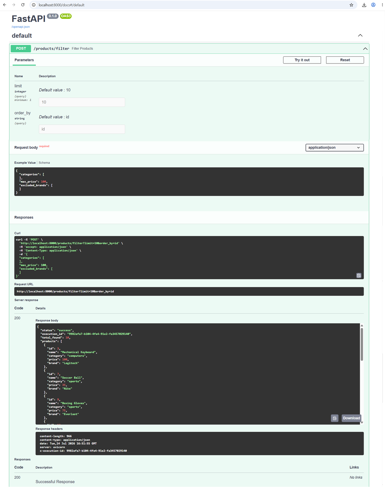
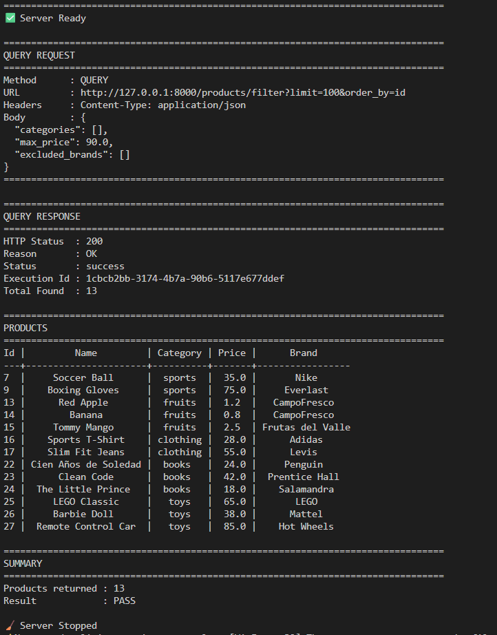
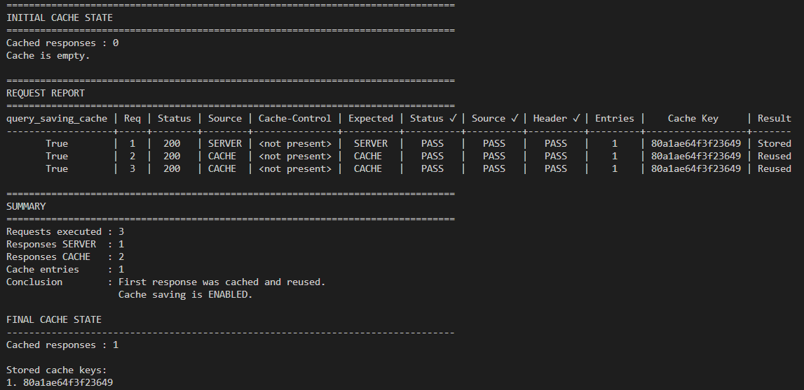
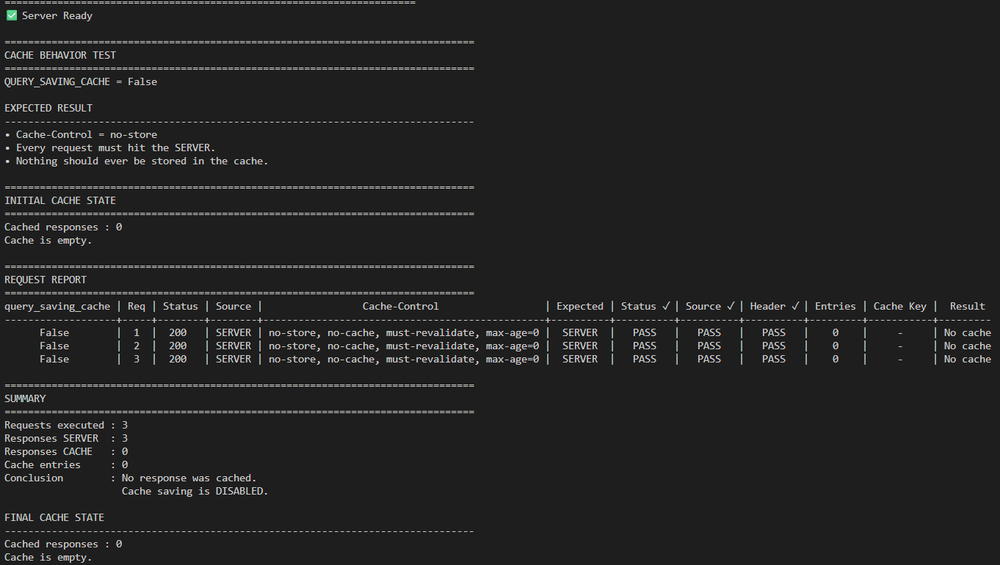

# FastAPI Extended Query Method

Native HTTP QUERY support for FastAPI.

## Overview

`FastAPIWithQueryHttpMethod` extends FastAPI with native support for the
HTTP QUERY method while preserving the FastAPI developer experience.

## Installation

``` bash
pip install fastapi-extended-query-method
```

## Quick Start

``` python
from src.fastapi_extended_query_method import FastAPIWithQueryHttpMethod

app = FastAPIWithQueryHttpMethod(query_saving_cache=True)
```

## Swagger compatibility

After starting the application:

    http://localhost:8000/docs

OpenAPI and Swagger do **not** currently support the HTTP QUERY method.

For that reason this package automatically exposes QUERY endpoints as
both:

-   QUERY
-   POST

Use the **POST** operation in Swagger only for interactive testing.

Real clients should invoke the QUERY method directly.

<p align="center">
  
</p>

## Cache

`query_saving_cache=True` allows caching.

`query_saving_cache=False` automatically adds:

-   Cache-Control: no-store
-   Pragma: no-cache
-   Expires: 0

## Testing API

``` bash
python validate_data/test_api_query_method.py
```

<p align="center">
  
</p>

## Testing Cache

### Using Cache Stored
``` bash
python validate_data/test_cache_comparison.py
```
<p align="center">
  
</p>

### NO Using Cache Stored
<p align="center">
  
</p>

## License

MIT